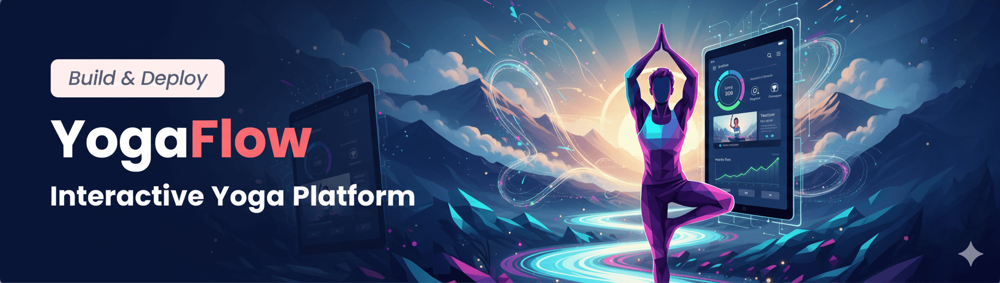

<div align="center">
  <br />
    <a href="#" target="_blank">
      
    </a>
  <br />

  <div>
     
    
    
   
  </div>

<h3 align="center">🧘‍♀️ YogaFlow: An Interactive Yoga Platform</h3>

</div>


## ✨ Welcome to YogaFlow!

**YogaFlow** is a visionary project aimed at revolutionizing the online yoga experience. This full-stack interactive platform is designed to blend high-quality educational content with dynamic service-based features, catering to yoga enthusiasts from absolute beginners to advanced practitioners. Our goal is to create a seamless, engaging, and comprehensive digital space for wellness and personal growth.

---

## 💡 Project Overview

In an ever-evolving digital landscape, YogaFlow emerges as a solution to provide accessible, structured, and interactive yoga content. Beyond just video tutorials, we offer a vibrant community experience with live classes, personalized progress tracking, and engaging challenges. Built with modern web technologies, YogaFlow is poised to be a leader in the online wellness sector.

### 🎯 Key Objectives:

* **Deliver a high-quality educational and service-oriented yoga application.**
* **Provide multi-level content:** Beginner, Intermediate, Advanced.
* **Enable direct interaction:** Users with trainers, live sessions.
* **Offer flexible monetization:** Free content, premium subscriptions, one-time bookings.
* **Ensure a modern, responsive, and animated UI/UX.**

---

## 🚀 Key Features

### 📚 Educational Features:

* **Video Tutorials:** Extensive library categorized by difficulty, style, and focus.
* **Articles & Tips:** Supplementary content for deeper understanding and practice insights.
* **Structured Training Programs:** Guided multi-week journeys for progressive learning.
* **Daily/Weekly Challenges:** Gamified activities to encourage consistent practice and engagement.

### 🌟 Service & Interactive Features:

* **User Registration & Personalized Profiles:** Tailored experience with practice history and preferences.
* **Live Class Booking System:** Seamless scheduling and participation in live sessions with certified trainers.
* **Progress Tracking:** Visualized achievements, badges, and milestones to motivate users.
* **Notifications & Reminders:** Timely alerts for classes, new content, and challenges.

### 💰 Monetization Strategy:

* **Free Tier:** Accessible basic content for introductory users.
* **Premium Subscriptions:** Full access to exclusive content, advanced programs, and special features.
* **One-Time Booking:** Flexibility for individual live classes without a subscription.

---

## 💻 Technology Stack

YogaFlow is engineered with a robust and scalable architecture:


---

## 📋 Project Structure (Directory Tree)

This project adopts a clean and modular directory structure to ensure maintainability, scalability, and easy navigation for all contributors.

  📦yogaflow
 ┣ 📂.github
 ┃ ┣ 📂ISSUE_TEMPLATE
 ┃ ┃ ┣ 📜bug_report.md
 ┃ ┃ ┗ 📜feature_request.md
 ┃ ┗ 📂workflows
 ┃ ┃ ┗ 📜main.yml
 ┣ 📂docs
 ┃ ┣ 📜API_Documentation.md
 ┃ ┣ 📜Architecture_Design.md
 ┃ ┣ 📜Database_Schema.md
 ┃ ┣ 📜Deployment_Guide.md
 ┃ ┗ 📜RPD_Document.md
 ┣ 📜.DS_Store
 ┣ 📜.env.example
 ┣ 📜.gitignore
 ┣ 📜CONTRIBUTING.md
 ┣ 📜LICENSE
 ┣ 📜README.md
 ┣ 📜package-lock.json
 ┗ 📜package.json


 ---

## 🛠️ Getting Started

To get a local copy up and running, follow these simple steps.

### Prerequisites:

* Node.js (LTS version recommended)
* npm or yarn (package manager)
* MongoDB or PostgreSQL instance (for local development)

### Installation:

1.  **Clone the repository:**
    ```bash
    git clone [https://github.com/your-username/YogaFlow.git](https://github.com/AhmedSabry70/YogaFlow.git)
    cd YogaFlow
    ```
2.  **Install client dependencies:**
    ```bash
    cd src/client
    npm install # or yarn
    cd ../..
    ```


---

## 🤝 Contribution

We welcome contributions! Please read our [CONTRIBUTING.md](CONTRIBUTING.md) for detailed guidelines on how to contribute and the requirements for all contributors, including signing our Contributor License Agreement (CLA).

---

## 📄 License

This project is proprietary and all rights are reserved by the YogaFlow Team. Please see the `LICENSE` file for more details.

---

## 📧 Contact

**YogaFlow Team** - [mrsabry134@gmail.com](mailto:mrsabry134@gmail.com)

**Project Link:** [https://github.com/AhmedSabry70/YogaFlow](https://github.com/AhmedSabry70/YogaFlow)

---
